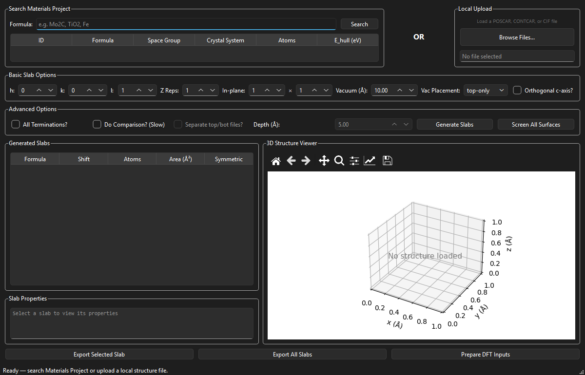
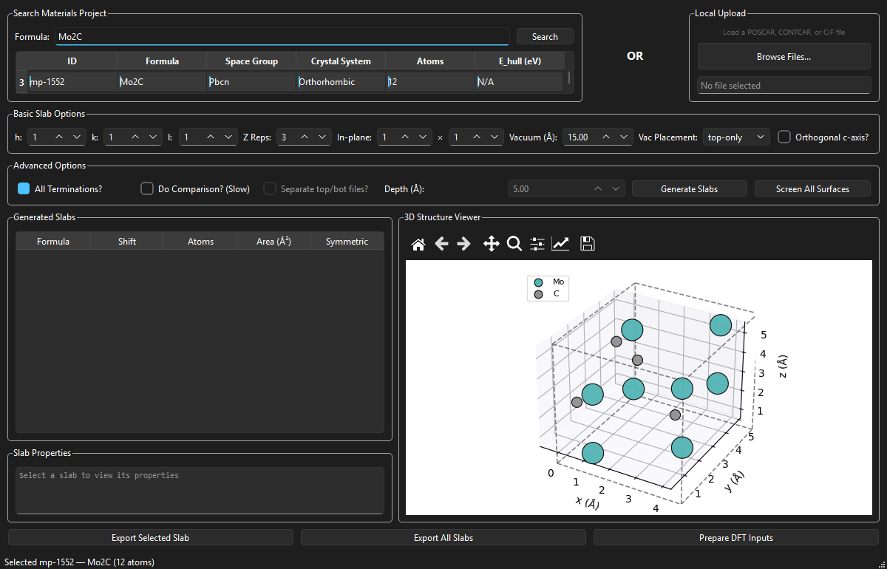
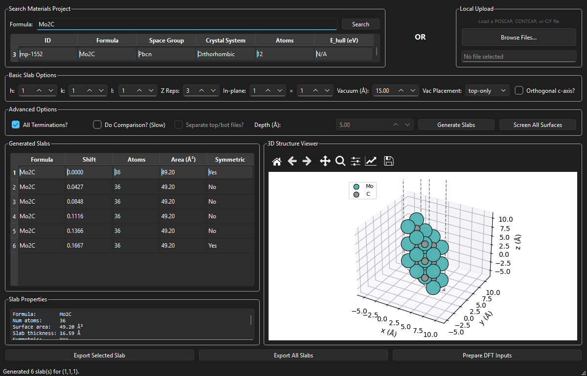
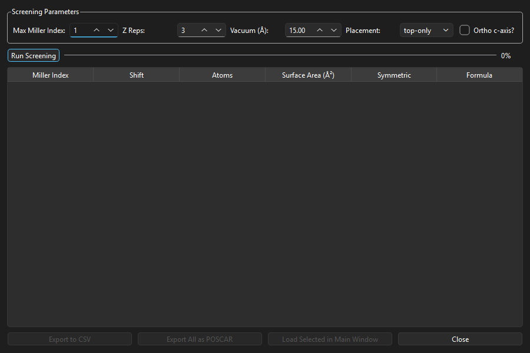

# SlabGen Feature Demonstration

A complete walkthrough of SlabGen's workflow using alpha-Mo2C (mp-1552, Pbcn, orthorhombic): load the structure from Materials Project, generate surface slabs, screen orientations, and prepare DFT inputs.

## Quick Start

```bash
# Run the GUI
python main.py

# Capture all demo screenshots automatically (Mo2C workflow)
python demo/scripts/capture_gui_screenshots_v2.py

# Or run the programmatic demo (no GUI)
python demo/scripts/quick_demo.py
```

---

## Step 1: Application Startup



The application launches with an empty 3D viewer, ready to accept a structure from Materials Project or local file upload.

---

## Step 2: Search Materials Project for Mo2C


Enter "Mo2C" in the formula field and click Search. The application queries the Materials Project API.


Three Mo2C polymorphs are returned. We select **mp-1552** -- the ground-state alpha-Mo2C (space group Pbcn, orthorhombic, 12 atoms).

---

## Step 3: Bulk Structure Visualization


The 3D viewer displays the bulk Mo2C unit cell. Mo atoms appear in teal, C atoms in gray. The lattice box shows the orthorhombic cell (a=4.72, b=6.00, c=5.20 A). Status bar confirms: "Selected mp-1552 -- Mo2C (12 atoms)".

---

## Step 4: Configure and Generate Slabs



Slab generation parameters:
- **Miller indices**: (1, 1, 1)
- **Z Reps**: 3
- **Vacuum**: 15.0 A
- **All Terminations**: checked



After clicking "Generate Slabs", the results table shows **6 unique terminations** for Mo2C (1,1,1) with shift values (0.0000--0.1667), atom counts, surface areas (49.20 A^2), and symmetry flags (2 symmetric, 4 asymmetric).

---

## Step 5: Inspect Slab Properties


Selecting a slab updates the 3D viewer (note the extended z-axis with vacuum) and fills the properties panel:
- Formula: Mo2C
- Atoms: 36
- Surface area: 49.20 A^2
- Slab thickness: 16.59 A

---

## Step 6: Surface Screening



Click "Screen All Surfaces" to open the screening dialog. For the 12-atom Mo2C cell, max Miller index 1 screens all low-index surfaces.


Results: **20 terminations across 7 surface orientations**. The table shows Miller indices, shifts, atom counts, surface areas, and color-coded symmetry (green = symmetric, yellow = asymmetric). Export to CSV or batch-export all as POSCAR.

---

## Step 7: DFT Input Generation


The DFT dialog generates a complete VASP input set with live INCAR preview:
- ENCUT = 400 eV, ISIF = 2, ISMEAR = 0
- Auto dipole correction (LDIPOL, IDIPOL=3, DIPOL calculated from slab center of mass)
- KPOINTS with k_z = 1 for slab geometry
- Selective dynamics option for frozen-layer calculations
- SLURM job script

---

## Step 8: Final State


Complete workflow: Mo2C slabs generated, properties visible, ready for POSCAR export or DFT calculations.

---

## Keyboard Shortcuts

| Shortcut | Action |
|----------|--------|
| Enter | Search Materials Project |
| Ctrl+G | Generate Slabs |
| Ctrl+E | Export Selected Slab |
| Ctrl+D | Prepare DFT Inputs |
| Ctrl+Shift+S | Screen All Surfaces |
| Ctrl+O | Upload Local File |

---

## Features Summary

1. **Materials Project Integration** -- search by formula, select from results
2. **3D Visualization** -- Jmol colors, lattice box, interactive rotation
3. **Slab Generation** -- configurable Miller indices, vacuum, supercells, all terminations
4. **Surface Screening** -- batch exploration with symmetry analysis
5. **DFT Workflow** -- VASP inputs with dipole correction, selective dynamics
6. **Export** -- single slab, batch POSCAR, CSV screening results
