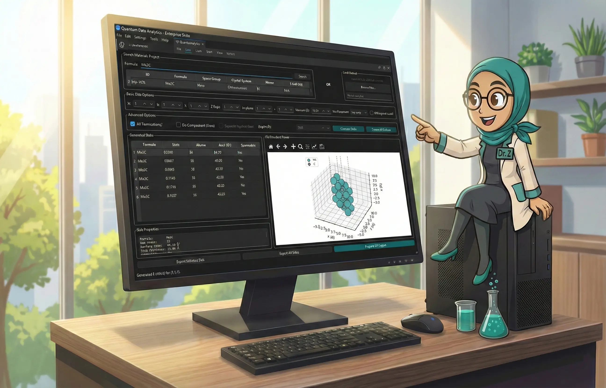

# SlabGen -- Surface Slab Generation Platform

A **PySide6 GUI** for generating, screening, and exporting surface slabs of crystalline materials, with integrated 3D visualization and DFT workflow preparation.

> **Created by [Shahab Afshar](https://github.com/shahabafshar) and [Zeinab H. Fard](https://scholar.google.com/citations?user=uvxuhmIAAAAJ&hl=en), Iowa State University.**

---



---

## Features

- **Materials Project Integration** -- search by formula (e.g. `Mo2C`), browse results with space group, crystal system, atoms, energy above hull
- **Local File Upload** -- load POSCAR, CONTCAR, or CIF files directly
- **Slab Generation** -- configurable Miller indices (h,k,l), z-repetitions, vacuum thickness, all unique terminations
- **Interactive 3D Viewer** -- embedded matplotlib canvas with Jmol color scheme, lattice box, rotation/zoom
- **Surface Screening** -- batch exploration of all symmetrically distinct surfaces with progress bar and symmetry analysis
- **DFT Input Generation** -- VASP INCAR (with auto dipole correction), KPOINTS (k_z=1 for slabs), POSCAR, POTCAR.spec, SLURM job script
- **Export** -- single slab POSCAR, batch POSCAR export, CSV screening results

---

## Architecture

```text
SlabGen/
├── main.py                    # Entry point (thin launcher)
├── core/
│   ├── slab_generator.py      # Slab generation + oriented replication
│   ├── screening.py           # SurfaceScreener: batch Miller index screening
│   ├── dft_inputs.py          # DFTInputGenerator: VASP input files
│   └── visualization.py       # 3D structure plotting (Jmol colors, lattice box)
├── ui/
│   ├── main_window.py         # MainWindow: primary GUI with 3D viewer
│   ├── viewer_widget.py       # StructureViewer: embeddable matplotlib 3D canvas
│   ├── screening_dialog.py    # Batch screening dialog with results table
│   └── dft_dialog.py          # DFT input configuration with INCAR preview
├── demo/
│   ├── scripts/               # Demo and poster generation scripts
│   └── output/                # Generated outputs (screenshots, plots, DFT inputs)
└── demo_output/               # GUI screenshots for documentation
```

### Key Algorithm: `oriented_slab_replication`

Two-stage slab generation avoids atom-stretching artifacts:
1. **Orient**: rotate bulk crystal so target (h,k,l) aligns with z-axis, replicate along z
2. **Generate**: apply `SlabGenerator` with (0,0,1) on the oriented structure for vacuum and terminations

---

## Requirements

Python 3.8+ with the following packages:

```bash
pip install -r requirements.txt
```

Dependencies: `mp-api`, `pymatgen`, `PySide6`, `matplotlib`, `numpy`

**Optional**: Place a [Materials Project API key](https://materialsproject.org/api) in `mp_api_key.txt` in the project root. Without it, MP search is disabled but local file upload works.

---

## Quick Start

```bash
# Clone and install
git clone https://github.com/shahabafshar/SlabGen.git
cd SlabGen
pip install -r requirements.txt

# (Optional) Add your Materials Project API key
echo "YOUR_API_KEY" > mp_api_key.txt

# Run the GUI
python main.py
```

### Demo Scripts

```bash
# Capture GUI screenshots automatically (Mo2C workflow)
python demo/scripts/capture_gui_screenshots_v2.py

# Programmatic demo with plots and DFT inputs (no GUI)
python demo/scripts/quick_demo.py

# Generate GPSS conference poster (48x36 PPTX)
python demo/scripts/generate_poster.py

# Generate presentation slides (13 slides, 16:9 PPTX)
python demo/scripts/generate_presentation.py
```

---

## Usage Workflow

1. **Search or Upload**: enter a formula (e.g. `Mo2C`) and search Materials Project, or upload a local POSCAR/CIF
2. **Select Structure**: pick from search results -- the 3D viewer shows the bulk unit cell
3. **Configure Slabs**: set Miller indices (h,k,l), z-repetitions, vacuum, check "All Terminations"
4. **Generate**: click "Generate Slabs" -- results table shows all terminations with shift, atoms, area, symmetry
5. **Inspect**: select a slab to view in 3D with properties (formula, atoms, surface area, thickness)
6. **Screen**: click "Screen All Surfaces" to batch-explore all symmetrically distinct orientations
7. **Export**: export individual slabs as POSCAR, batch-export all, or prepare full VASP input sets

### Keyboard Shortcuts

| Shortcut | Action |
| -------------- | ----------------------- |
| Enter | Search Materials Project |
| Ctrl+G | Generate Slabs |
| Ctrl+E | Export Selected Slab |
| Ctrl+D | Prepare DFT Inputs |
| Ctrl+Shift+S | Screen All Surfaces |
| Ctrl+O | Upload Local File |

---

## Case Study: Mo2C

Using alpha-Mo2C (mp-1552, Pbcn, orthorhombic, 12 atoms):

- **(1,1,1) surface**: 6 unique terminations, 36 atoms each, 49.20 A^2 surface area
- **Full screening** (max Miller index 1): 20 terminations across 7 surface orientations, 10 symmetric + 10 asymmetric
- **DFT inputs**: INCAR with auto dipole correction, KPOINTS with k_z=1, SLURM job script

See [FEATURE_DEMONSTRATION.md](FEATURE_DEMONSTRATION.md) for the complete walkthrough with screenshots.

---

## Export Filename Convention

```text
POSCAR_{mat_id}_{h}-{k}-{l}_z{z_reps}_vac{vacuum}_{placement}{ortho}_shift{shift}.vasp
```

---

## Citing This Work

If you use SlabGen in academic or research work, please cite it. You can use GitHub's built-in **"Cite this repository"** button on the sidebar, or use the BibTeX entry below:

```bibtex
@software{afsharghoochani2025slabgen,
  author    = {Afsharghoochani, Shahab and H. Fard, Zeinab},
  title     = {{SlabGen}: An Interactive Platform for Automated Surface Slab
               Generation, Screening, and {DFT} Workflow Preparation},
  year      = {2025},
  url       = {https://github.com/shahabafshar/SlabGen},
  license   = {MIT}
}
```

---

## Contributing

1. Fork the repo and create your feature branch (`git checkout -b feature/awesome-feature`)
2. Commit your changes (`git commit -am 'Add awesome feature'`)
3. Push to the branch (`git push origin feature/awesome-feature`)
4. Open a Pull Request

---

## License

Distributed under the [MIT License](LICENSE.md).

---

## Acknowledgments

- [Materials Project](https://materialsproject.org/) for crystal structure data and the `mp-api` client
- [pymatgen](https://pymatgen.org/) for structure objects, slab generation, and surface analysis
- [PySide6](https://pypi.org/project/PySide6/) for the cross-platform Qt6 GUI framework
- [matplotlib](https://matplotlib.org/) for embedded 3D visualization
