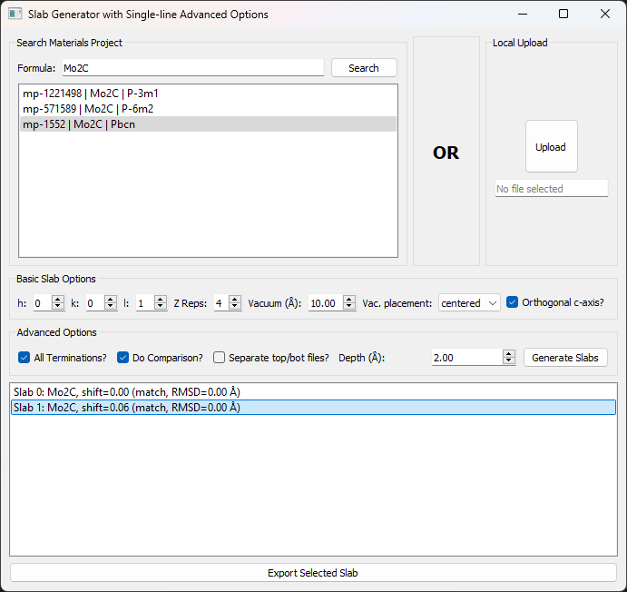

# Slab Generator GUI (PyQt5 + Pymatgen + mp-api)

A user-friendly **graphical interface** (GUI) for generating and exporting **surface slabs** of crystalline materials, with options to:

- **Search Materials Project** (using `mp-api`) for a bulk structure, **OR** upload a **local POSCAR**.
- Specify **Miller indices** *(h, k, l)*, **slab thickness** (Å), **vacuum thickness** (Å), and vacuum placement (top-only or centered).
- Generate **multiple terminations** automatically (all unique shifts) and optionally **force an orthogonal c-axis**.
- **Export** the resulting slab(s) to `.vasp` with a suggested filename that encodes slab parameters.

This GUI is built with **PyQt5** for the interface, **pymatgen** for structure manipulation, and **mp-api** for accessing the new Materials Project API.


> **Created through a collaboration between myself and my wife,  
> Dr. [Zeinab Hajali Fard](https://scholar.google.com/citations?user=uvxuhmIAAAAJ&hl=en), Ph.D. student at ISU.**
---

## Features

- **Two methods** of providing a bulk structure:
  1. Query the Materials Project (enter a formula, e.g., `Mo2C`), then select from returned structures.
  2. **Upload** a local VASP file *(POSCAR, CONTCAR, or `.vasp`)* to use as the bulk.
- **Easy slab customization**:
  - (h, k, l) Miller index
  - Slab thickness and vacuum thickness
  - Vacuum placement: top-only or centered
  - Single or **all terminations** (slab shifts) from `SlabGenerator`
  - Force orthogonal c-axis using `get_orthogonal_c_slab()`
- **GUI**: A simple, multi-column layout with clear “OR” separation for the two input methods, plus an advanced panel for slab generation options.
- **Filename suggestion**: The export dialog suggests a `.vasp` name embedding **Miller indices, thickness, vacuum, shift,** etc.
- **No atom “stretching”**: We rely on PyMatgen’s internal methods for correct vacuum creation and optional orthogonalization.

---

## Screenshot



---

## Requirements

Make sure you have Python 3.8+ installed. Then install the following Python packages:

```bash
pip install mp-api pymatgen PyQt5
```

Or you can use a `requirements.txt` with the following content:

```
mp-api
pymatgen
PyQt5
```

In addition, if you want to **search the Materials Project**, you need:
1. A **Materials Project account**.
2. A **new** API key from [materialsproject.org/api](https://materialsproject.org/api).

Save that key in a file named `mp_api_key.txt` in the **same directory** as the script (the code will read it automatically). If this file is missing or empty, you can still upload a local structure, but the Materials Project features will be disabled.

---

## Getting Started

1. **Clone** this repository:
   ```bash
   git clone https://github.com/<YOUR-USERNAME>/<REPO-NAME>.git
   cd <REPO-NAME>
   ```
2. **(Optional) Create a virtual environment**:
   ```bash
   python -m venv venv
   source venv/bin/activate    # On Linux/Mac
   venv\Scripts\activate       # On Windows
   ```
3. **Install dependencies**:
   ```bash
   pip install -r requirements.txt
   ```
   *(Or see the “Requirements” section above.)*
4. **(Optional) Provide your MP API key**:
   - Create a text file called **`mp_api_key.txt`**.
   - Paste your API key on the first line.
   - Save in the **root** of this project (same folder as `main.py`).

---

## Usage

1. **Run the GUI**:
   ```bash
   python main.py
   ```
2. In the GUI:
   - **Left Panel**: Type a formula (e.g. “Mo2C”), click **Search**, and select a structure from the list. 
   - **OR**: In the **right panel**, click **Upload** to browse for a local `POSCAR`, `CONTCAR`, or `.vasp`.
   - Adjust **Miller indices (h, k, l)**, **slab thickness**, **vacuum** thickness, vacuum placement (top-only or centered).
   - **Optional**: Check “All Terminations?” to explore different slab shifts. Check “Orthogonal c-axis?” to reorient the slab.
   - Click **Generate Slabs**. 
   - A list of generated slabs appears below. Pick one, then **Export** to `.vasp`. The code suggests a filename that encodes your chosen parameters.

---

## File Structure

```
<PROJECT-ROOT>/
├─ main.py               # The primary PyQt5 application
├─ mp_api_key.txt        # (Optional) Your Materials Project API key
├─ requirements.txt      # Requirements for the project
├─ SlabGen.png           # GUI screenshot image
└─ ...
```

- **`main.py`**: Contains all the GUI code.  
- **`mp_api_key.txt`**: Optional file. If present, the code will read your new Materials Project API key from here.  
- **`requirements.txt`**: Lists the dependencies needed to run this code.
- **`SlabGen.png`**: A screenshot of the project UI.

---

## Referencing This Work

If you use or build upon this project in an **academic** or **research** context, please **cite** the repository and the authors (yourself and *Zeinab Hajalifard*) accordingly. For example, using an **IEEE-style reference**:

```
[1] S. Afsharghoochani and Z. Hajali Fard, "Slab Generator GUI (PyQt5 + Pymatgen + mp-api)", 
GitHub repository, 2023. [Online]. Available: https://github.com/shahabafshar/SlabGen
```

---

## Example Flow

1. Start the GUI:  
   `python main.py`
2. Enter a formula, e.g. **`Mo2C`**, then **Search**. Wait for the results.  
3. Select a structure from the list (e.g., `mp-14181 | Mo2C | P6/mmm`).  
4. **OR** click **Upload** if you prefer a local file.  
5. Adjust `(h, k, l)`, set `min_slab_size` (slab thickness), `min_vacuum_size` (vacuum), pick “top-only” or “centered.”  
6. Check “All Terminations?” if you want multiple surface shifts, or “Orthogonal c-axis?” if you want the slab reoriented.  
7. Click **Generate Slabs**. A list of possible slabs appears.  
8. Pick a slab from the list, click **Export**. A file dialog suggests `POSCAR_{mat_id}_{h}-{k}-{l}_slab{slab_thick}_...`.  
9. Save the file. That `.vasp` can be opened in VESTA, PyMOL, or used in **DFT codes** (e.g., VASP).

---

## Contributing

1. **Fork** the repo and create your feature branch (`git checkout -b feature/awesome-feature`).  
2. **Commit** your changes (`git commit -am 'Add awesome feature'`).  
3. **Push** to the branch (`git push origin feature/awesome-feature`).  
4. **Open a Pull Request**.

We welcome improvements or bug fixes, especially around new surface analysis features, alternate visualization, or better user guidance in the GUI.

---

## License

This project is distributed under the [MIT License](LICENSE.md). You are free to use, modify, and distribute this software in accordance with the license terms.

---

## Acknowledgments

- [**Materials Project**](https://materialsproject.org/) for providing crystal data and the new `mp_api` client.  
- [**Pymatgen**](https://pymatgen.org/) for robust structure objects and slab generation.  
- [**PyQt5**](https://pypi.org/project/PyQt5/) for the cross-platform GUI framework.  

---

**Enjoy generating surface slabs!** If you have questions or encounter issues, please open an [Issue](../../issues) on GitHub. 

